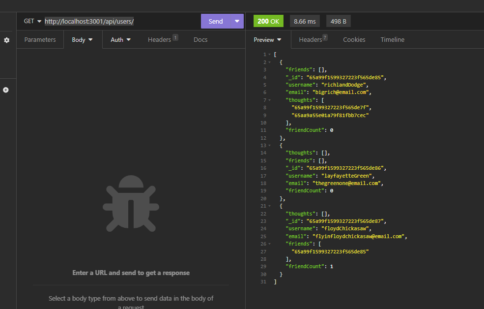

# Social-Media-Site
The Server side of a social media website created in MongoDB.

## Description
Uses mongoDB and Mongoose for database manangement, Dotenv for database connection, and Express.

## Installation
Run  'npm i'  to install dependencies.

## Usage
Input 'npm start' to start server.
Navigate to http://localhost:3001/ in Insomnia
Utilize routes as follows

-USERS AND ADDING FRIENDS-

http://localhost:3001/api/users/   -to find all or create a new user.

http://localhost:3001/api/users/:userId   -to get, update, or delete a specific user.

http://localhost:3001/api/users/:userId/friends/:friendId    -to add and delete friend.

-THOUGHTS AND REACTIONS-

http://localhost:3001/api/thoughts    -to find all or create a new thought.

http://localhost:3001/api/thoughts/:thoughtId   -to get, update, or delete a specific thought.

http://localhost:3001/api//thoughts/:thoughtId/reactions    -to create and delete reactions.

Link to github repository.
https://github.com/kingbgreen5/social-media-api

Link to Video Demo
 https://drive.google.com/file/d/1HI5l_pHvCUmMRTd01BoOGHmim2zoP9X6/view?usp=sharing

## Credits
Starter code taken from Edx Bootcamp activity 25.
 

## License
MIT
